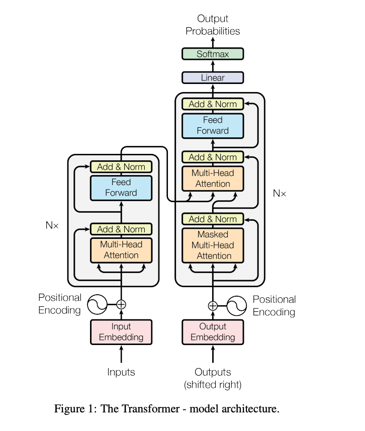
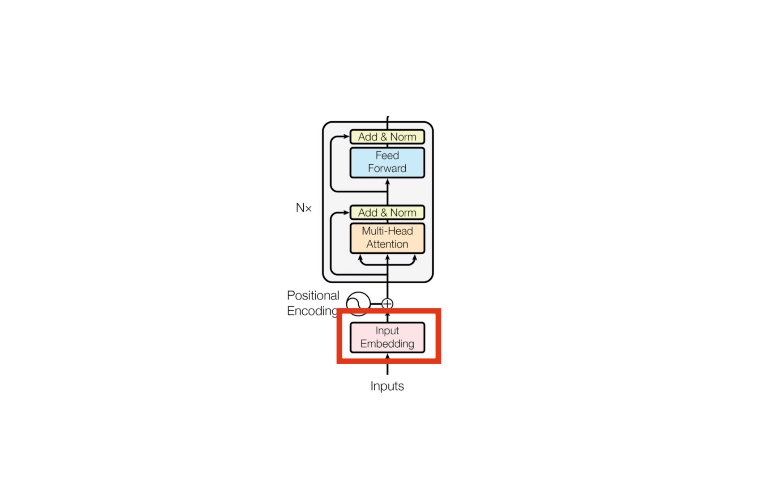
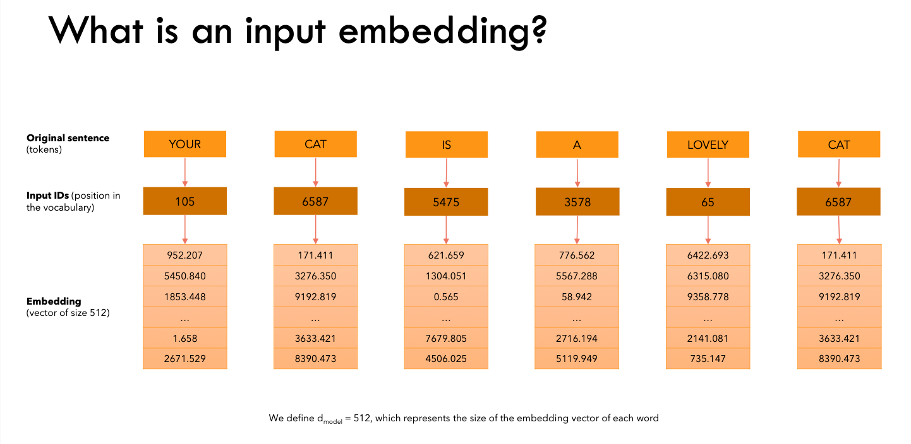
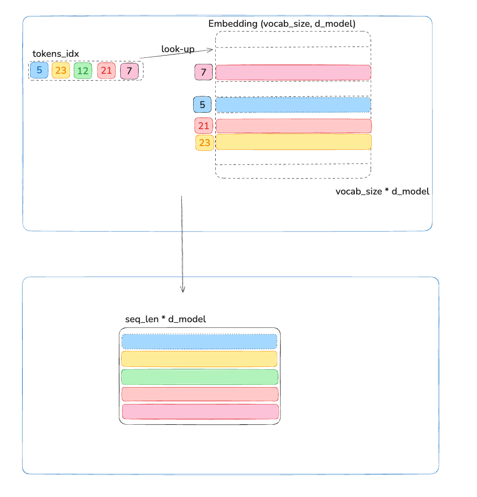
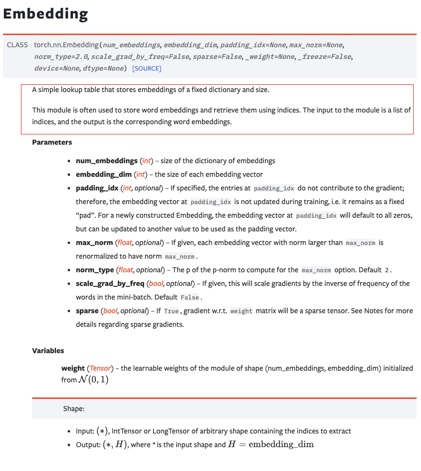

# Transformer详解

[toc]

# 1. InputEmbeddings
 
<center><strong>Figure 2: The Transformer - component inputembeddings</center>

</br>

```python

class InputEmbeddings(nn.Module):

    def __init__(self, d_model: int, vocab_size: int) -> None:
        super().__init__()
        self.d_model = d_model
        self.vocab_size = vocab_size
        self.embedding = nn.Embedding(vocab_size, d_model)

    def forward(self, x):
        # (batch, seq_len) --> (batch, seq_len, d_model)
        # Multiply by sqrt(d_model) to scale the embeddings according to the paper
        return self.embedding(x) * math.sqrt(self.d_model)

```
1. inputs是一个个token的idx组成的序列,用来表示一句话,最大长度为seq_len. Example:
```
idx = [12,32,12,321,22,31,11]
```

2. InputEmbeddings的作用是将由tokens‘ id组成的sentences通过该嵌入层转化成一个```(seq_len * d_model) ```的矩阵.如果加上```batch_size```维度为 ```(batch_size, seq_len, d_model) ```

<center><strong>Figure 3: The Transformer - What is an input embedding?  </center>

</br>

3. 通常inputs的维度为(batch_size, seq_len),InputEmbeddings使用```torch.nn.Embedding(vocab_size, d_model)```进行创建.

4. 该过程实在是通过```torch.nn.Embedding(vocab_size, d_model)```构建了一张```(vocab_size, d_model)```的表, inputs中的idx是一个个token的索引,当它进度embeeding层是便可以基于look-up方式对input_idx中的每个索引表示某个单词或子词在词汇表中的位置查询出对应的```word embedding vector```组成一个新的矩阵, 如Figure 4所示:
<center><strong>Figure 4: The Transformer - Inputembeddings' internal mechanism </center>

</br>

5. 这里关于Embeeding层的内部运算机制可以参考torch的官方文档:(https://pytorch.org/docs/stable/generated/torch.nn.Embedding.html)


# 2. PositionalEncoding

<center><strong>Figure 5: The Transformer -  PositionalEncoding</center>